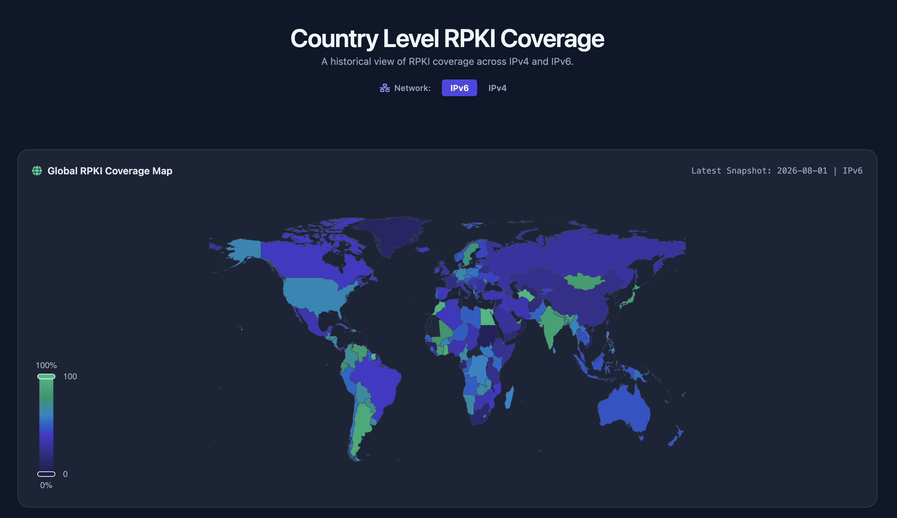
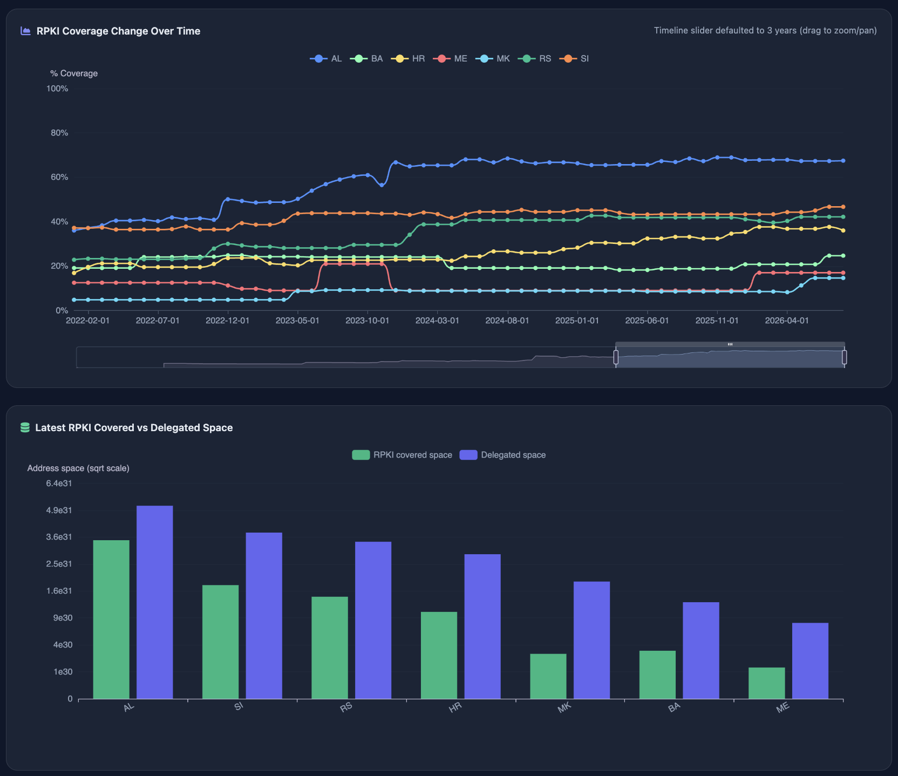

# Country Level RPKI Coverage

**RPKI History Dashboard built with Airflow, dbt, Clickhouse， DuckDB-Wasm, and ECharts**

Explore the interactive dashboard [here.](https://zifeng-ma.github.io/rpki_history_dbt/)

## Overview

This project visualises the historical coverage of Resource Public Key Infrastructure (RPKI) across IPv4 and IPv6 on a per‑country basis. 

Key capabilities:
- **Country‑level RPKI coverage map** (world map) with IPv4/IPv6 toggle.
- **Top‑10 fastest coverage growth** for selectable time windows (1, 3, 5 years).
- **Time‑series line chart** for arbitrary country selections.
- **Covered vs delegated address‑space comparison** per country.
- **Client‑side data processing** – no backend required.

## Usage

- Use the **IPv4 / IPv6** buttons in the header to switch IP version.
- Select a **time window** (1, 3, 5 years) to view growth rankings.
- Click region preset buttons (**CAPIF**, **SEE**, **MENOG**) or manually tick countries.
- Search for a country code/name with the search bar.
- Zoom/pan the charts with mouse or the data‑zoom slider.

## Data Source

[RIPEstat RPKI History](https://stat.ripe.net/docs/data-api/api-endpoints/rpki-history.html)

